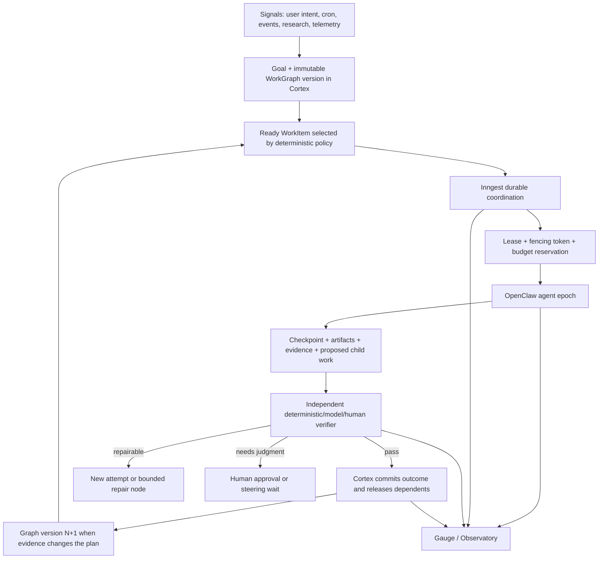
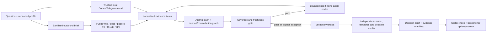

# Ora Agent Runtime: From Loops to a Durable WorkGraph

**Decision brief — 2026-07-21 America/Los_Angeles (corpus inventory through 2026-07-22 UTC)**
**Recommendation confidence:** high on the architecture boundary; medium on rollout effort until a shadow pilot establishes baseline recovery, latency, and cost.

> **Audit correction:** the architecture recommendation below still stands, but the original private-corpus snapshot overstated the safety and completeness of current Cortex/Telegram recall. The subsequent tenant/privacy audit found NULL-organization writes, cross-tenant failure modes, outbound-model exposure of private text, and incomplete direct evidence. Treat the private-corpus counts in this document as historical orientation only and use the corrected [multichannel research audit](./ora-multichannel-research-audit-2026-07-21.md#cortex-and-telegram-p0-before-integration) for rollout decisions. Trusted recall must remain disabled until its P0 gates pass.

## Executive decision

Ora should not choose between Inngest and long-running agents. It should make them different layers of one operating system:

> **Graphs coordinate loops. Loops execute graph nodes. Cortex owns durable truth.**

- **Cortex/Postgres** should be the canonical work and evidence plane: goals, immutable graph versions, work items, attempts, artifacts, approvals, budgets, policies, evaluations, and lineage.
- **Inngest** should remain the durable macro coordinator: triggers, schedules, waits, retries, fan-out/fan-in, concurrency, cancellation signals, and human gates.
- **OpenClaw agents** should perform dynamic reasoning and tool work inside bounded, restartable execution epochs. An objective may run for days; no individual process, context window, or gateway owns it for days.
- **OpenClaw Task Flow** should mirror local detached work and provide Gateway operations, but not become the global source of truth because its authoritative store is Gateway-local SQLite.
- **Gauge/Observatory** should project graph, attempt, agent, tool, cost, and evaluation data into an operator read model.
- **Agent evolution** should be a separate, slower graph: production evidence or expert correction → failing eval → candidate version → holdout replay → independent review → shadow/canary → promote or reject.

The first active pilot should be Braintied Research itself. It is open-ended enough to benefit from agent workers, evidence-heavy enough to force good lineage, and reversible enough to run in shadow. Convert its synchronous internal request into `research.start/status/result/cancel`, execute a versioned research WorkGraph, and compare it with the existing monolithic runner before expanding this pattern to proactive actions or coding agents.

Do **not** add Temporal, LangGraph, Restate, DBOS, Hatchet, or another agent framework now. Their best semantics are useful references, but another runtime would create a second control plane before Ora has unified the one it already owns.

## What “loops to graphs” actually means

Peter Steinberger's June post argued that developers should design loops that prompt agents instead of repeatedly prompting them by hand ([direct X post](https://x.com/steipete/status/2063697162748260627)). His July follow-up asked whether the discussion had already shifted from loops to graphs ([direct X post](https://x.com/steipete/status/2078277297791189132)). These are trend signals, not architecture specifications.

The useful distinction is operational:

| Layer | Primary question | Durable output |
|---|---|---|
| Prompt | What should one model response do? | Prompt version |
| Context | What should this turn know? | Context manifest |
| Harness | What tools, permissions, workspace, and stop rules govern one run? | Agent/runtime version |
| Loop | How does one worker observe, act, verify, remember, and continue? | Checkpoint + artifacts |
| Graph | Who owns each work item, what depends on what, and what can run or recover next? | Graph version + attempts |
| Evolution | How are prompts, skills, policies, topology, and models improved safely? | Evaluated candidate lineage |

A 2026 scheduler-theoretic position paper characterizes a classic agent loop as a “single ready unit” scheduler with implicit dependencies and opaque next-step choice. It proposes explicit graph execution for controllability, while openly acknowledging the expressiveness tradeoff and providing no production implementation or empirical result ([paper](https://arxiv.org/abs/2604.11378)). Inngest's own durable-agent documentation supplies the missing synthesis: an agent's graph can be drawn dynamically as the model runs, while completed LLM and tool steps are memoized for deterministic recovery ([Inngest durable agents](https://www.inngest.com/docs/learn/durable-agents)).

Therefore:

- Use a **loop** when the next action is genuinely unknown and model judgment adds value.
- Use a **graph** when dependencies, ownership, policy, concurrency, waits, or irreversible effects are known.
- Use a **dynamic graph revision** when new evidence creates legitimate new work.
- Never hide a known dependency or side effect inside a model context merely to keep the topology “agentic.”

## Desired Ora architecture



This extends Ora's approved Agentic OS rather than replacing it. The existing planes—Thread, Identity, Desired State, Coordination, Guard, and Observatory—are exactly the connective tissue a WorkGraph requires. The approved direction already calls for correlation across boundaries, atomic claims/leases, a composed policy gate, and a unified read model ([Ora Agentic OS](/Users/g/Development/ora-ai/platform/docs/architecture/agentic-os.md)).

Ora should keep four related graphs distinct instead of creating one overloaded “knowledge graph”:

| Graph | Lifetime | Nodes/edges | Authority |
|---|---|---|---|
| **OrgGraph** | Long-lived | agents, humans, teams, skills, tools, permissions, delegation | Identity + Desired State |
| **WorkGraph** | Per durable objective, versioned | work items, dependencies, attempts, approvals, artifacts | Cortex Coordination plane |
| **EvidenceGraph** | Durable and updateable | claims, supporting/contradicting evidence, decisions, outcomes | Cortex knowledge/research plane |
| **EvolutionGraph** | Slow release cycle | candidate agent/prompt/skill/policy/topology versions and evaluations | Guard + eval/promotion service |

The OrgGraph answers “who may do this,” the WorkGraph answers “what is ready,” the EvidenceGraph answers “why do we believe this,” and the EvolutionGraph answers “what version earned promotion.” They share IDs and provenance, but have different mutation and review rules.

### Canonical work model

Use a small append-oriented core rather than encoding state in chats or Inngest payloads:

| Entity | Purpose | Important invariants |
|---|---|---|
| `goal` | Durable user/business objective | Tenant, owner, risk class, success contract |
| `work_graph_version` | Immutable topology at a point in time | Hash, parent version, planner/policy versions |
| `work_item` | A node and dependency set | Typed input/output contracts; no silent mutation |
| `attempt` | One executor's bounded epoch | Lease, fencing token, agent/model/harness version, budget |
| `work_event` | Append-only state transition | Actor, correlation, causation, timestamp, prior/new state |
| `artifact` | Durable externalized work state | Content hash, storage ref, media type, visibility, producer |
| `evidence_item` | A sourced observation | Exact span/ref, dates, authority class, retrieval/query lineage |
| `approval` | Human or policy decision | Scope hash, single-use consumption, actor, expiry |
| `budget_reservation` | Reserved cost/time/tool capacity | Reserve/commit/release; parent and child totals reconcile |
| `evaluation` | Outcome/process/safety evidence | Evaluator version, subject version, reproducible inputs |

Every event and artifact should carry at least:

```text
organization_id, goal_id, graph_id, graph_version, work_item_id,
run_id, attempt_id, parent_id, correlation_id, causation_id,
actor_id, agent_version, policy_version, created_at
```

### Bounded agent epoch contract

“Long-running agent” should mean a durable objective with replaceable executors. A worker epoch should have a typed boundary such as:

```ts
runEpoch({
  workItemVersion,
  checkpointRef,
  policyVersion,
  leaseToken,
  budget,
  correlation,
}): Promise<{
  status:
    | 'progress'
    | 'succeeded'
    | 'blocked'
    | 'needs_approval'
    | 'retryable_failure'
    | 'terminal_failure';
  checkpointRef: string;
  artifactRefs: string[];
  evidenceRefs: string[];
  proposedChildWork: ProposedWork[];
  usage: Usage;
}>;
```

The agent may propose child work, memory updates, policy changes, or a new graph. A deterministic coordinator decides what enters canonical state.

### Durability rules

1. **Lease and fence every attempt.** An expired worker may finish late; its stale fencing token must make the commit fail.
2. **One retry owner per boundary.** Provider, agent, HTTP client, and Inngest retries must not multiply the same side effect.
3. **Hash irreversible actions.** Tool name, normalized arguments, target, policy version, and approval scope form an idempotency key and receipt.
4. **Checkpoint at semantic milestones.** Read/edit/test/browser micro-loops stay inside OpenClaw. Approvals, external effects, expensive calls, phase boundaries, and waits cross a durable boundary.
5. **Bound cancellation latency.** Check a cancellation token between tool calls; keep epochs short enough that “cancel” has an operational meaning.
6. **Detect no progress.** Repeated state, error, or artifact hashes trip a circuit breaker instead of burning another unbounded loop.
7. **Version, do not silently mutate.** Replanning creates explicit child nodes or graph version N+1; an active attempt remains attributable to its input version.
8. **Externalize large state.** Inngest currently documents 4 MiB step results, 32 MiB total run state, 1,000 steps, and a two-hour maximum step duration ([limits](https://www.inngest.com/docs/usage-limits/inngest)). Source bodies, screenshots, trajectories, quote pools, and drafts belong in content-addressed Cortex/object artifacts; workflow state carries small references and hashes.

### Security and authority boundary

Autonomy should expand by reducing ambient authority, not by adding constant approval prompts. Each WorkItem should receive a capability manifest: exact tools, target resources, data classes, network domains, write scopes, monetary budget, and expiry. Run attempts in disposable sandboxes with no inherited host credentials; fetch short-lived, task-scoped credentials only when a policy gate allows them. OWASP classifies excessive functionality, permissions, and autonomy as the core “excessive agency” risk ([guidance](https://genai.owasp.org/llmrisk/llm062025-excessive-agency/)), while NIST's current agent-identity work emphasizes authorization and trustworthy software-agent identity ([NIST concept paper](https://csrc.nist.gov/pubs/other/2026/02/05/accelerating-the-adoption-of-software-and-ai-agent/ipd)).

Use humans for true judgment boundaries—external publication, customer communication, money movement, production deployment, new privileges—not for mechanically approving every harmless tool call. The Guard should verify current evidence and scope at action time; an old approval must not authorize changed arguments, target, graph version, or policy.

## Why keep Inngest

Inngest already supports the important semantics: memoized steps, deterministic recovery through prior results, event waits that hold no process, durable sleeps, child function/agent invocation, retries, and multi-agent fan-out ([durable-agent documentation](https://www.inngest.com/docs/learn/durable-agents)). This means Ora does not need to bypass Inngest to let agents run for hours or days. It needs to stop equating an Inngest function with the entire cognitive lifetime of an objective.

Use Inngest for:

- waking and scheduling work;
- moving a WorkItem into a claimed Attempt;
- waiting for agent completion, human input, provider callbacks, or timers;
- retrying infrastructure boundaries;
- releasing dependent nodes and fan-in barriers;
- cancellation and failure handlers;
- delivery and cleanup.

Do not use Inngest for:

- every token or file edit;
- large source/evidence payloads;
- mutable canonical graph state;
- model-owned retry loops around irreversible actions;
- an 8–15 minute synchronous HTTP request that hides all intermediate progress.

OpenClaw Task Flow now provides durable flow status, JSON state, revision conflicts, sticky cancellation, child task links, and restart survival. Its documentation also explicitly says flows coordinate tasks rather than replace them and recommends separating schedule, sessions, deterministic Lobster steps/approvals, and Task Flow tracking ([Task Flow](https://docs.openclaw.ai/automation/taskflow)). Because its state lives in `~/.openclaw/state/openclaw.sqlite`, Ora should mirror these flows to canonical Cortex IDs, not make a stateless Fly gateway's local database the global authority.

## Framework decision

| System | Capability worth learning from | Ora decision |
|---|---|---|
| [Inngest](https://www.inngest.com/docs/learn/durable-agents) | Dynamic durable steps, waits, invokes, recovery | Keep as macro coordinator |
| [OpenClaw Task Flow](https://docs.openclaw.ai/automation/taskflow) | Detached tasks, revision conflicts, sticky cancel | Mirror locally; Cortex remains canonical |
| [Temporal](https://docs.temporal.io/workflows) | Mature replay, signals, long-lived workflows, version discipline | Benchmark only if a measured hard requirement fails |
| [Restate](https://docs.restate.dev/ai/patterns/durable-agents) | Per-key actors/single writers and durable promises | Borrow mailbox/single-writer semantics |
| [DBOS](https://docs.dbos.dev/ai/ai-quickstart) | Postgres-backed durable transactions | Borrow state-colocation ideas |
| [Trigger.dev](https://trigger.dev/docs/tasks/overview) | Long-running compute and process checkpointing | Consider only for a specialized compute need |
| [LangGraph](https://docs.langchain.com/oss/javascript/langgraph/persistence) | Checkpoints, interrupts, replay, forks | Borrow semantics; avoid a second Python runtime |
| [PydanticAI](https://pydantic.dev/docs/ai/capabilities/durable_execution/overview/) | Typed agent contracts across durable backends | Borrow contract/retry guidance |
| [OpenHands](https://docs.openhands.dev/sdk/guides/convo-persistence) | Persistent workspaces, event histories, context condensation | Borrow artifact and compaction patterns |

Temporal should be reconsidered only after a benchmark demonstrates a hard need such as strict multi-year actor semantics, query/signal behavior, history branching, self-hosted control, or workflow-version guarantees that Inngest plus Cortex cannot satisfy. “More durable” in the abstract is not enough to justify a migration.

## What current evidence says about agent autonomy

Agents are improving, but capability is not the same as safe operational autonomy. Anthropic's February 2026 analysis found the 99.9th-percentile Claude Code turn grew from under 25 minutes to over 45 minutes over three months, while experienced users both auto-approved more and interrupted more. Its conclusion is closer to active monitoring than blind delegation ([study](https://www.anthropic.com/research/measuring-agent-autonomy)). METR reports a rapid long-task capability trend, but cautions that very long horizon estimates are uncertain and are human-task-difficulty equivalents, not literal unattended run duration ([METR time horizons](https://metr.org/time-horizons/)).

Long-horizon engineering reports converge on persistent workspaces, explicit progress files, milestone verification, context compaction, fresh handoffs, and the ability to resume—not one enormous conversation. Anthropic's long-running harness guidance uses an initializer, incremental agents, a feature/task list, commits, and tests to bridge context windows ([harness guidance](https://www.anthropic.com/engineering/effective-harnesses-for-long-running-agents)).

Multi-agent topology must be chosen economically. Anthropic reports that token usage explained most performance variance in its research system and that multi-agent research used far more tokens than ordinary chat; it found the pattern most valuable for parallelizable, high-value tasks. Its production lessons emphasize resumability, checkpoints, tracing, artifact handoffs, small eval sets, and outcome-based evaluation ([multi-agent research system](https://www.anthropic.com/engineering/multi-agent-research-system)). Ora should therefore make delegation a budgeted graph decision, not a default aesthetic.

## Ora audit: the pieces exist, the shared contract does not

Ora is already a graph of loops: a 21-agent OpenClaw fleet, Cortex Worker Inngest functions, tool dispatch, proactive actions, research pipelines, Watchtower, Gauge, and a Conductor harness. The missing feature is not another framework; it is shared work identity and authority.

The July 2026 audit found:

- The approved Agentic OS already identifies missing Thread, Identity, Desired State, Coordination/leases, Guard, and Observatory planes.
- A live seven-day telemetry snapshot contained 47,616 agent/LLM/tool events but no populated `parent_run_id`; a 24-hour sample had 772 LLM calls without usable correlation. These are snapshot findings, not permanent counts, but they show that a graph cannot yet be reconstructed from telemetry.
- Long-running job tables exist but had only three lifetime live rows in the audited environment, all with zero recorded cost; the path is barely adopted.
- The existing Conductor validates DAGs, executes parallel waves, and reserves budgets, but is in-memory and cannot resume, so it is a design harness rather than the production runner.
- The current Ora research long-job path launches detached `void executeFullResearch(...)` work ([research handler](/Users/g/Development/ora-ai/platform/apps/ora-server/plugins/tool-dispatch/handlers/research.ts)), while the scheduler is a local interval loop ([research scheduler](/Users/g/Development/ora-ai/platform/apps/ora-server/plugins/research-scheduler/index.ts)). A crash after a job is marked running can lead to failure/reaping rather than fenced reclaim and resume.
- Approval consumption, cross-organization delegation, trust-evidence counting, graph-wide budget ancestry, and detached warm-pool completion need hardening before autonomous graph expansion.

P0 is therefore not “add more agents.” P0 is:

1. shared IDs and Thread propagation;
2. atomic leases with fencing;
3. single-use, scope-hashed approval consumption;
4. parent/child budget reservations;
5. append-only attempt/action receipts;
6. graph-aware tracing and operator controls.

## Private Braintied/Telegram corpus findings

**Superseded for implementation decisions.** This section records the first-pass inventory, not a safe retrieval contract. See the audit correction above and the newer tenant/privacy findings before using any count or proposed recall path.

The private corpus was queried separately from outbound research. No private text or identifiers were sent to external providers.

As of 2026-07-22 UTC, the audited Braintied surfaces contained:

- 3,229 canonical Telegram messages since 2026-02-19; 350 matched the orchestration vocabulary;
- 30,389 Cortex discoveries, including 1,925 Telegram-ingested discoveries;
- 1,467 Telegram-ingested X posts and 15,803 `research_kb` rows;
- only 376 feedback actions across 264 discoveries.

The strongest source-traceable themes were consistent with the external evidence:

- Peter's maintainer loop uses a coordinator, parallel workers, durable queue/log, evidence gates, and human exceptions ([maintainer post](https://x.com/steipete/status/2064998499780084154), [public skill](https://github.com/steipete/agent-scripts/blob/main/skills/maintainer-orchestrator/SKILL.md)).
- Practitioner designs repeatedly converge on Triage → Conductor → Worker → Verifier → Gate → Trust Ledger.
- Long-running work uses disposable/isolated executors, durable state outside the worker, watchdogs, explicit `awaiting_reply`, and independent verification.
- Self-learning proposals converge on trace + human correction as distinct evidence streams, and on propose → evaluate → keep/revert rather than live self-editing.

These are design signals. Promotional performance claims and uncited Thoth syntheses were not treated as independent proof.

### Corpus quality defect that must block autonomous learning

Of the 1,467 Telegram-ingested X discoveries, 1,437 had canonical captured text in `x_research_posts`, but only 1,041 exposed `original_post_text` on the discovery row. The audit found 330 high-scored rows with missing or extremely thin direct text and 150 records containing access-failure language; 100 of those still carried verdict scores of 8 or higher.

The current answer path can construct context from generated title/summary without joining canonical X text. That creates a self-confirming loop: an inaccessible source receives a confident synthetic interpretation, the interpretation receives a high verdict, and future agents retrieve the interpretation as if it were source truth.

Before research can drive graph evolution:

1. make `research_search` the sole supported agent recall surface;
2. join canonical platform text and Telegram share provenance into every result;
3. quarantine inaccessible/thin-source records from answer synthesis and evolution;
4. persist Thoth/human analysis as typed annotations, not source text;
5. add actions such as `source_verified`, `claim_rejected`, `user_corrected`, `experiment_passed`, `experiment_failed`, `recommendation_adopted`, and `superseded`;
6. connect decisions to implementation and production outcomes.

## Reusable Braintied Research WorkGraph



Important boundaries:

- Public research and private recall are separate artifacts. Private evidence remains in trusted execution unless an explicit policy allows a sanitized summary.
- Social sources discover leads and document practitioner experience; official documentation/code establishes technical capabilities when available.
- Every claim retains supporting and contradicting evidence IDs, confidence rationale, dates, and falsifiers.
- Coverage can fail the run. A completed synthesis is not automatically a valid decision brief.
- `snapshot`, `update`, and `monitor` are modes of the same engine. Update mode compares claim/evidence state (`added`, `confirmed`, `changed`, `retracted`, `contested`) against a pinned baseline.
- Large artifacts live outside Inngest; durable events carry references.

### Internal API

Keep `answer` and possibly `quick` synchronous. Make `standard`, `deep`, `social`, and mixed-corpus programs asynchronous:

```text
POST /research/start   -> run_id, graph_version, accepted budget
GET  /research/status  -> node/attempt state, coverage, cost, gaps
GET  /research/result  -> report + evidence/lineage manifest
POST /research/cancel  -> sticky cancel intent
```

The current `research.run` route performs the complete package call inside one HTTP request. During this investigation, local preflight saw Agent Auth, but both the live execution route and the newly added authenticated catalog probe returned HTTP 404 from production. The current source tree contains the route, so this is deployment/route drift—not evidence that the research engine ran.

## Controlled agent and graph evolution

Agent evolution is promising only where “better” can be evaluated externally. GEPA evolves prompts against task feedback ([paper](https://arxiv.org/abs/2507.19457)); AFlow searches workflow code with benchmark feedback ([paper](https://arxiv.org/abs/2410.10762)); AlphaEvolve combines candidate generation, automated evaluators, and an archive of prior programs ([paper](https://arxiv.org/abs/2506.13131)). These results support an evaluation lab, not production agents rewriting their own policies.

Ora's evolution graph should be:

```text
production trace or expert correction
  → minimized failing eval case
  → candidate prompt / skill / model / tool / topology / policy version
  → repeated replay on development and hidden holdout sets
  → independent quality + safety + cost review
  → shadow
  → bounded canary
  → human/policy promotion or rejection
  → rollback always retained
```

Hard rules:

- A candidate cannot modify its hidden evaluator or promotion policy.
- The proposer cannot be the only grader.
- No candidate deploys itself.
- Promotion weighs correctness, safety, cost, latency, variance, and policy compliance.
- One stochastic success is insufficient; require repeated trials and confidence bounds.
- Production corrections become labeled eval evidence with user/team/app ownership—not global prompt folklore.
- Topology evolution proposes a new immutable graph version; it does not mutate an active run.

## 30/60/90-day rollout

### Days 0–30: observable shadow foundation

1. Standardize `goal_id`, `graph_id`, `graph_version`, `work_item_id`, `run_id`, `attempt_id`, parent/correlation/causation IDs, `agent_version`, and `policy_version`.
2. Add append-only WorkGraph/Attempt/Event/Artifact records as a shadow projection of current Inngest and OpenClaw work.
3. Implement lease + fencing-token claims and parent/child budget reservation.
4. Make approval scope immutable and consumption atomic.
5. Instrument OpenTelemetry/OpenInference-style `AGENT`, `LLM`, `TOOL`, `RETRIEVER`, `RERANKER`, `GUARDRAIL`, and `EVALUATOR` spans ([OpenInference](https://arize-ai.github.io/openinference/spec/)). Pin convention versions because GenAI conventions are still evolving.
6. Deploy the Braintied Research catalog route and use the authenticated probe in CI/release smoke tests.
7. Shadow one existing Nex heartbeat/proactive flow into the graph without changing its behavior.

### Days 31–60: Braintied Research active pilot

1. Introduce `research.start/status/result/cancel` and execute a versioned research WorkGraph.
2. Add the tenant-scoped Cortex/Telegram evidence adapter and join canonical X text/share provenance.
3. Run public provider searches in parallel child functions; persist bodies and evidence as artifacts.
4. Add claim/evidence lineage, contradiction grouping, freshness and lane-coverage gates.
5. Add deterministic citation/link/date checks plus an independent semantic verifier.
6. Shadow the graph runner against the current runner on the 24 golden briefs; add the Ora agent-runtime brief to the eval set.
7. Chaos-test worker death, duplicate events, stale leases, cancellation, provider outage, deploy-during-wait, and budget exhaustion.

### Days 61–90: bounded autonomy and evolution lab

1. Promote the research graph if it passes reliability, quality, and cost gates.
2. Pilot a self-healing builder that may inspect, edit in an isolated worktree, test, and draft a PR—but cannot merge or deploy.
3. Add user corrections and production outcomes to the evidence/action vocabulary.
4. Build offline candidate generation and replay for research prompts/source policies; require shadow/canary promotion.
5. Expand WorkGraph projections to proactive actions and other Ora products only after graph lineage and tenant controls are demonstrably complete.

## Acceptance gates

| Area | Initial gate |
|---|---|
| Traceability | 100% of pilot attempts have goal/graph/work/run/attempt/correlation and actor IDs |
| Exclusivity | Zero accepted commits from stale fencing tokens; zero duplicate irreversible effects in chaos tests |
| Recovery | ≥95% of injected worker/process deaths resume from the last accepted checkpoint without repeating completed side effects |
| Cancellation | Sticky cancellation prevents new child work; active-epoch cancellation latency is bounded and measured |
| Budget | No run exceeds accepted graph budget; parent equals committed + released + live child reservations |
| Research boundary | Zero private/restricted corpus content in outbound provider fixtures and logs |
| Evidence | Every critical recommendation links to evidence; missing required lanes make coverage fail explicitly |
| Source quality | Thin/inaccessible source records cannot satisfy a primary-evidence requirement |
| Verification | Citation/link/date checks pass; semantic support and contradiction recall improve over the current baseline |
| Evolution | No candidate can modify evaluator/promotion policy, self-deploy, or bypass holdout + shadow/canary gates |

Do not set arbitrary production thresholds without a baseline. Capture two weeks of shadow data, then pin targets for latency, cost, recovery, coverage, and quality before active promotion.

## What not to do

- Do not replace Inngest merely because agents can run longer.
- Do not keep a single agent process alive as the durability strategy.
- Do not route every agent tool call through a workflow step.
- Do not add a second canonical graph store inside OpenClaw or another framework.
- Do not let Task Flow SQLite become the source of truth on stateless Fly machines.
- Do not allow retry policies at several layers to act on the same side effect.
- Do not equate source popularity, a model verdict score, or inclusion in a brief with truth.
- Do not let the same agent propose, grade, approve, and deploy its own evolution.
- Do not copy private Telegram/Cortex text into an outbound research brief.

## Revisit triggers

Reconsider the runtime boundary if:

- Inngest cannot meet a measured recovery, versioning, signal/query, retention, or control-plane requirement after a representative benchmark;
- OpenClaw Task Flow gains a shared, tenant-safe external authority that can replace the mirror safely;
- graph-run payload/history pressure regularly approaches Inngest limits despite artifact externalization and fan-out;
- a controlled evolution pilot improves held-out quality and cost consistently enough to justify topology optimization;
- operator burden or graph complexity exceeds the benefit for simple tasks, suggesting a deliberate return to a single bounded loop.

## Research provenance and gaps

The intended Braintied deep run did **not** complete. The internal path returned HTTP 404 before provider execution; the local fallback reached Gemini planning but was rejected with `API_KEY_INVALID`. No report metadata or grounding result was produced, and incurred provider/model cost was **$0.00**. The analysis above was assembled from:

- direct official documentation and primary engineering/research sources;
- direct public X URLs recovered through the Braintied Telegram capture path;
- clearly labeled Reddit/Hacker News practitioner anecdotes;
- a separate tenant-scoped Cortex/Telegram audit;
- a read-only audit of Ora and `@braintied/research` code and live operational snapshots.

Known gaps:

- The exact implementation effort for a shared WorkGraph schema needs a migration/code spike in Ora's dirty working tree.
- Social APIs did not yield a complete engagement/quote-tweet graph; engagement counts are not used as architectural proof.
- The live telemetry and job counts are point-in-time snapshots and should be regenerated before setting production targets.
- No chaos benchmark has yet compared the proposed epoch/checkpoint model with the current path.
- Semantic claim entailment, contradiction recall, and source-authority evaluation are not yet implemented in the package.

## Implementation added to `@braintied/research`

This investigation added reusable foundations without creating another engine:

- `ora-agent-runtime@1`, a versioned investigation profile with public, social, and trusted-local source packs; coverage, verification, output, update, and data-boundary policies;
- deterministic profile compilation into separate `outboundBrief` and `privateRecallBrief` artifacts;
- typed `EvidenceItem`, `ResearchClaim`, `ResearchFinding`, and `ResearchRunContext` contracts with stable hashes/IDs;
- fail-closed coverage evaluation for evidence count, source diversity, author diversity, freshness, and required lanes;
- an authenticated internal catalog probe that catches missing deployment routes before a billable run;
- tests proving private recall cannot enter the compiled outbound brief and that missing/stale source lanes fail coverage.

The next package changes should be hard budget reservation, search option/recency propagation, stronger untrusted-content boundaries, non-permissive deep critique, a Cortex evidence adapter, and semantic claim verification. The next Ora changes should be made only after reconciling the existing dirty worktree and deploying the already-present internal route.
