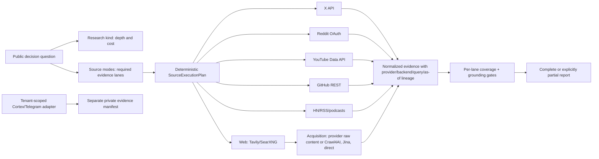

# Ora Multichannel Research System Audit

**Effective date:** 2026-07-21 America/Los_Angeles
**Scope:** Braintied Research, Ora Cortex, the Braintied Research Telegram corpus, X, Reddit, YouTube, GitHub, the public web, Tavily, Crawl4AI, Bright Data, and Apify.
**Current verdict:** the new public-source architecture is implemented and tested in the package checkout, and bounded live probes now confirm Reddit, YouTube, twitterapi.io, and Bright Data access. The production system is **not yet exhaustive or deployment-ready**: the provider contract fixes are not deployed, the deployed internal research route is missing, Apify authentication is invalid, and trusted Cortex/Telegram recall has tenant and data-boundary defects that must be fixed before it is enabled.

## Executive decision

Ora should use one evidence engine with orthogonal controls:

- A **research kind** controls depth, model work, latency, and cost: `quick`, `standard`, `deep`, or `social`.
- A **source mode** controls which evidence lanes must actually run: `web`, `x`, `reddit`, `youtube`, `github`, `community`, `cortex`, and `telegram`.
- A **provider policy** controls discovery, acquisition, enrichment, and fallback inside each lane.
- A **coverage gate** prevents a successful model answer from being mislabeled as exhaustive when a required lane returned no eligible evidence.

The resulting boundary is:

> Structured platform/search APIs are the control plane for discovery. Bright Data is the preferred high-fidelity social acquisition and backfill plane. Apify is the last scraper fallback. Tavily discovers and can return web content; Crawl4AI acquires pages after discovery. Cortex and Telegram stay inside a trusted tenant-scoped recall boundary.

Bright Data should be used heavily, but not indiscriminately. Its current catalog supports genuine keyword discovery for Reddit and YouTube, while its X endpoints focus on known URLs, usernames, and profile lists. It therefore cannot replace X API v2's global keyword, conversation, operator, and incremental-search semantics ([Bright Data social endpoint catalog](https://docs.brightdata.com/api-reference/scrapers/social-media-apis/overview), [X recent search](https://docs.x.com/x-api/posts/search-recent-posts)).

## Honest status as of July 21

| Lane or boundary | Configuration | Live result | Exhaustive status | Required action |
|---|---|---|---|---|
| Tavily web discovery | Present in Cortex Worker | Healthy; six results in the bounded probe | Available | Keep as quality-first web discovery and raw-content source |
| SearXNG breadth | Two Braintied instances available | Failover returned three results | Available but monitor both instances | Add recurring instance health and result-quality checks |
| Crawl4AI acquisition | Present; internal scraper reachable | Healthy; fetched 16,706 characters from a current Inngest page | Available | Keep out of the search planner; use only after URL discovery |
| Reddit | OAuth client configured | Healthy; recharge recheck returned three dated threads, HTTP 200 | Available | Keep native OAuth primary; add Bright Data backfill for keyword/subreddit and comments |
| YouTube | Data API key configured | Healthy; recharge recheck returned three dated videos, HTTP 200 | Available | Keep native API primary; add Bright Data transcript/comment backfill |
| GitHub | No token configured | Public unauthenticated search returned six results | Degraded by restrictive unauthenticated search quota | Add a project-owned `GITHUB_TOKEN` and query-specific monitoring |
| X | twitterapi.io configured; official X and Apify are fallbacks | Healthy after recharge: HTTP 200 and 20 tweets in the current status-less cursor envelope | Available in the local package; not deployed | Deploy the tested envelope/pagination fix; retain official X second and repair Apify only as the last fallback |
| Bright Data social | Token configured; Instagram path tested offline | Healthy: a capped YouTube job reached `ready` and downloaded one structured transcript record | Acquisition contract proven; Reddit/YouTube routing not deployed | Deploy the tested asynchronous snapshot handler, then wire capped Reddit/YouTube backfill and X URL/profile enrichment |
| Braintied internal research API | Source tree contains route work | Production catalog/execute surface returned HTTP 404 | **Unavailable** | Reconcile dirty Ora worktree, review, deploy, and probe the catalog before model research |
| Ora Cortex trusted recall | Large corpus exists | Retrieval/security audit failed | **Unsafe** | Fix tenant writes, superuser fallback, explicit org predicates, and RPC grants |
| Braintied Telegram recall | Corpus exists but direct evidence is incomplete | Retrieval/security audit failed | **Unsafe and incomplete** | Add scoped FTS adapter, canonical-X joins, deletion handling, and direct-evidence coverage |

This distinction matters: an environment variable proves only that configuration was attempted. A healthy source requires an authenticated, bounded query; exhaustive coverage additionally requires enough eligible, dated, direct evidence and a passing coverage gate.

**Credential handling warning:** an over-broad local diagnostic printed assignment lines for the YouTube, Reddit, and twitterapi.io credentials into an agent terminal transcript. No values are reproduced in this report and no secrets were changed, but all three credentials must be rotated before rollout.

## Implemented package architecture

The package now compiles every required public lane into a deterministic provider-locked search. The model planner may add useful searches, but cannot silently omit a requested lane.



Important implementation properties:

1. `Crawl4AI` now advertises `search: false`; it cannot enter planner discovery.
2. Search controls—recency, exact `published_before`, sort, scopes, domains, pages, and limits—flow into provider calls and cache identity.
3. X samples fresh and high-signal rankings; Reddit samples relevance/top/new/comments; YouTube samples date/relevance/view count.
4. GitHub is a first-class source type for repositories, issues, pull requests, and implementation evidence.
5. Social cache lifetimes are short and exact as-of filtering excludes future evidence.
6. Required-lane discoveries retain source-pack and source-mode lineage through deduplication.
7. A run becomes `partial` when source coverage, profile coverage, or grounding fails.
8. Trusted recall is injected by Ora and returns a private manifest. Private evidence never enters the public planner, extraction, reranking, synthesis, or provider payloads.

Use a full RFC3339 boundary such as `2026-07-21T23:59:59-07:00` when “as of July 21” means the complete Los Angeles calendar day; a date-only boundary is interpreted as the end of that UTC date.

The main contracts are in [`source-modes.ts`](../src/source-modes.ts), [`research-program.ts`](../src/research-program.ts), and the versioned [`ora-agent-runtime` profile](../src/profiles/ora-agent-runtime.ts).

## Recommended provider policy

### Web

1. Use Tavily for quality-first discovery, exact date/domain controls, and raw content when available. Tavily's current search endpoint supports start/end dates, time ranges, domain inclusion/exclusion, and raw-content retrieval; advanced search consumes two credits ([Tavily Search API](https://docs.tavily.com/documentation/api-reference/endpoint/search)).
2. Use the Braintied SearXNG pool for free independent breadth and resilience.
3. Acquire discovered pages with provider-supplied raw content first, then Crawl4AI, Jina Reader, and direct HTTP. Crawl4AI is a browser/crawler configuration and content-extraction system, not a search engine ([Crawl4AI quickstart](https://docs.crawl4ai.com/core/quickstart/), [parameters](https://docs.crawl4ai.com/api/parameters/)).

### X

1. Use twitterapi.io as Braintied's lower-cost primary X search/fetch transport, subject to balance and contract health monitoring.
2. Use official X API v2 as the structured fallback when its recent endpoint can fully cover the requested window. It supplies keyword/operators, `conversation_id`, time/ID bounds, relevancy/recency sorting, and `next_token`; recent search covers the last seven days, while full archive is a separate paid capability ([search overview](https://docs.x.com/x-api/posts/search/introduction), [pagination](https://docs.x.com/x-api/posts/search/integrate/paginate), [operators](https://docs.x.com/x-api/posts/search/integrate/operators)).
3. Use Bright Data for known post URLs, profile watchlists, author histories, and enrichment. Do not label it global X keyword coverage until Bright Data exposes such an endpoint ([Bright Data X introduction](https://docs.brightdata.com/datasets/scrapers/twitter/introduction)).
4. Use Apify last, with a hard spend/record cap and actor contract tests.
5. In degraded mode, Tavily/SearXNG may discover direct X URLs, but this is not equivalent to X search or thread coverage and must be labeled partial.

### Reddit

1. Use the free native OAuth API for structured discovery, sort strata, pagination, and canonical thread/comment retrieval.
2. Use Bright Data as the preferred secondary discovery/backfill provider. It supports keyword and subreddit discovery plus post/comment collection by URL ([Bright Data Reddit introduction](https://docs.brightdata.com/datasets/scrapers/reddit/introduction), [keyword endpoint](https://docs.brightdata.com/api-reference/scrapers/social-media-apis/reddit-posts-discover-by-keyword)).
3. Use Apify only when both native and Bright Data paths fail or a required field is unavailable.

### YouTube

1. Use the free YouTube Data API for canonical search, channel/date filters, page tokens, and relevance/date/view/rating sorts ([YouTube `search.list`](https://developers.google.com/youtube/v3/docs/search/list), [pagination](https://developers.google.com/youtube/v3/guides/implementation/pagination)).
2. Retrieve transcripts and high-signal comments as evidence, recording transcript/comment completeness.
3. Use Bright Data for keyword/hashtag discovery and transcript/comment backfill when native quota or completeness is insufficient ([Bright Data YouTube introduction](https://docs.brightdata.com/datasets/scrapers/youtube/introduction), [keyword endpoint](https://docs.brightdata.com/api-reference/scrapers/social-media-apis/youtube-videos-discover-by-keyword)).
4. Use Apify last.

### GitHub and other high-value lanes

- Use GitHub's native REST search for repositories, issues, and pull requests; authenticated requests are important because search has separate restrictive limits ([GitHub REST rate limits](https://docs.github.com/en/rest/using-the-rest-api/rate-limits-for-the-rest-api)).
- Retain Hacker News, RSS, podcasts, official docs, papers, changelogs, release notes, and security advisories as independent evidence lanes.
- Add Stack Overflow/Stack Exchange when implementation questions justify it, and package registries plus dependency release feeds for software evaluations.
- Treat Instagram, TikTok, Facebook groups, and LinkedIn as optional modes rather than silently adding paid social collection to every investigation.

## Cortex and Telegram: P0 before integration

The trusted corpus audit invalidated the earlier assumption that Cortex/Telegram recall was already safe and exhaustive.

### Tenant integrity

- Live `research_discoveries` contained 30,389 Braintied rows, 7,104 NULL-organization rows, and 41 rows associated with a Sentigen organization. In the latest seven-day slice, 3,372 of 5,059 new discoveries lacked `organization_id`.
- The active base collector omits `organization_id` and deduplicates globally by URL hash.
- Some runtime DB access can fall back to the `postgres` role. `search_x_posts` lacks an explicit organization predicate, so RLS alone is insufficient under that failure mode.
- A report RPC is `SECURITY DEFINER`, accepts an arbitrary organization UUID, and has execution grants that are too broad for the proposed adapter.

### Evidence quality and privacy

- The corpus had 1,958 Telegram share sightings covering 1,938 discoveries.
- All 652 Telegram captures since July 6 lacked `original_post_text`; Telegram snippets are capped at 500 characters.
- Canonical X rows can recover 428 missing or thin Telegram-shared X records, but ten high-score X discoveries still lack usable direct text.
- Sixty-eight X summaries contained access-failure language; 48 nevertheless had scores of at least 8/10. Generated summaries therefore must not satisfy direct-evidence coverage.
- Current enrichment can send `original_post_text` to Gemini scoring, Voyage embeddings, and Gemini answer synthesis. Full private Telegram text must not be backfilled into that path.

The required design is one server-side composite adapter, `ora-cortex-braintied`, with independently measured `cortex` and `telegram` modes. It should derive the tenant from authenticated Agent Auth, default to local Postgres FTS, use explicit organization predicates, fail closed without the tenant role, enforce registered Telegram workspace/account/channel scope and deletion state, and make zero external model calls. It must return only private/restricted `EvidenceItem` records to a separate private manifest.

Longer term, split the current overloaded discovery record into:

```text
global public artifact
  -> tenant-scoped observation edge
  -> private annotation/share
  -> versioned derived analysis
```

Do not deploy or backfill trusted recall until the cross-tenant, externalization, canonical-evidence, pagination, and deletion acceptance tests pass.

## What the current loops-to-graphs evidence says

Peter Steinberger's June X post framed “loop engineering” as designing the repeated observe/act/verify process around an agent, and his July follow-up asked whether attention had already moved from loops to graphs ([June post](https://x.com/steipete/status/2063697162748260627), [July post](https://x.com/steipete/status/2078277297791189132)). The strongest interpretation is not that graphs replace loops:

> Graphs coordinate loops. A loop remains the right local primitive when the next action is unknown; a graph becomes necessary when dependencies, ownership, recovery, budgets, approvals, or irreversible effects are known.

Current practitioner discussion is useful counterevidence. Reddit threads repeatedly describe the loop itself as old/simple control flow and identify the hard problems as progress detection, a trustworthy definition of done, independent evaluation, context/tool design, and bounded spend ([June 23 discussion](https://www.reddit.com/r/aiagents/comments/1udgo7d/i_just_read_about_loop_engineering_and_the_shift/), [June 28 cost critique](https://www.reddit.com/r/AgentsOfAI/comments/1ui4a8k/the_loop_engineering_trend_is_a_financial/), [July 13 skepticism](https://www.reddit.com/r/AI_Agents/comments/1uvq0nh/can_anyone_explain_me_loop_engineering_like_im_5/)). A current explainer video is [“Loop Engineering explained in 8min”](https://www.youtube.com/watch?v=4biXYSNkn9Y), but videos and viral posts should be treated as trend/practitioner evidence rather than architecture proof.

OpenClaw's issue tracker supplies more actionable production evidence:

- A reported synchronous loop held the event loop for roughly eight minutes and stalled Telegram/Discord processing, supporting bounded replaceable agent epochs rather than a gateway-owned cognitive lifetime ([issue #74345](https://github.com/openclaw/openclaw/issues/74345)).
- Concurrent multi-agent configuration, session locks, OAuth races, and detached work support a canonical Cortex work plane with leases and fencing rather than local mutable state ([issue #43367](https://github.com/openclaw/openclaw/issues/43367)).
- Cron deadlock and tool-simulation reports reinforce the need for explicit recovery, verification, and observability ([issue #42579](https://github.com/openclaw/openclaw/issues/42579), [issue #45049](https://github.com/openclaw/openclaw/issues/45049)).

## Do we always need Inngest?

No. Inngest is valuable where durable coordination semantics are needed; it should not wrap every model turn, edit, browser action, or sub-minute local loop.

| Work shape | Runtime decision |
|---|---|
| Pure read, local transform, or short idempotent task | Plain function/process; no Inngest |
| Dynamic reasoning inside one bounded attempt | OpenClaw/agent loop with checkpoint and budget; no per-turn Inngest steps |
| Timer, webhook, retry, fan-out/fan-in, human wait, or cancellation boundary | Inngest |
| Multi-hour/day objective | Cortex WorkGraph plus repeated leased agent epochs; Inngest wakes and coordinates them |
| Canonical goal, graph, attempt, artifact, evidence, approval, or budget state | Cortex/Postgres, not Inngest history |
| Very large source bodies, screenshots, trajectories, or drafts | Object/content-addressed storage; workflow carries references |

The recommendation remains to keep Inngest as Ora's macro coordinator now, not because it is universally required, but because replacing it before Ora has canonical work identity, leases, checkpoints, and evidence lineage would exchange one incomplete control plane for another. Reconsider Temporal/Restate/DBOS only after a representative benchmark demonstrates a semantic requirement Inngest plus Cortex cannot meet.

## Code changes in this audit

- Added explicit source-mode definitions, backend policies, deterministic seeded searches, exact as-of controls, and fail-closed source-plan validation.
- Added a source-mode research coordinator that runs public research and trusted recall separately.
- Added a GitHub provider and GitHub repository/issue/code source types.
- Separated search-capable providers from acquisition-only Crawl4AI.
- Propagated search controls through the pipeline and into complete cache keys; shortened current/social cache lifetimes.
- Added current ranking/pagination/date/scope support for X, Reddit, YouTube, Tavily, and GitHub.
- Added X search/fetch ordering of twitterapi.io first, official X API v2 second, and Apify last. The official adapter fails closed instead of silently truncating a requested historical window to its seven-day recent endpoint.
- Updated twitterapi.io parsing for its live status-less `tweets`/cursor envelope and added bounded cursor pagination without weakening the separate fetch contract.
- Added a shared Bright Data acquisition contract that accepts immediate records or follows an accepted asynchronous snapshot through readiness and download; expanded the bounded deadline to cover observed live latency.
- Added a bounded, search-only public source health API with query hashes, backend/count/date/latency diagnostics, sanitized failures, strict caps, and no model/private-corpus work.
- Split Ora's Cortex and Telegram profile packs and added required YouTube/GitHub/community coverage.
- Repaired the SearXNG smoke script and expanded the local runner's provider allowlist and exact source/profile preflight.
- Added tests proving future evidence is excluded, missing lanes fail, Crawl4AI never enters search, and private trusted evidence never enters the public runner.

At the time of this report, the package test suite passed all 46 tests (38 unit/contract tests plus eight Instagram/Bright Data boundary tests), TypeScript validation, the production build, and the whitespace check. The checkout changes have not been released into Ora or deployed to production.

## Rollout sequence

### P0: make “current and exhaustive” truthful

1. Rotate the YouTube, Reddit, and twitterapi.io credentials exposed by the diagnostic, then re-run masked health checks.
2. Deploy the tested twitterapi.io and Bright Data contract fixes; retain a project-owned official X bearer token second and repair the invalid Apify token only as the last fallback.
3. Deploy and schedule the new capped source probe; add quota/cost telemetry to its provider results and alert on backend/coverage regressions.
4. Reconcile and review the existing Ora internal-tools work, deploy `research.run`, and require the authenticated production catalog probe in release health.
5. Fix organization assignment, global URL uniqueness, superuser fallback, explicit tenant predicates, overly broad RPC grants, and Telegram poller scope.
6. Implement the FTS-only `ora-cortex-braintied` adapter and keep its results outside all external model stages.

### P1: operationalize provider policy

1. Configure Bright Data Reddit and YouTube dataset contracts as secondary discovery/backfill lanes with record and dollar caps.
2. Configure Bright Data X known-URL/profile enrichment; never use it as evidence of global X keyword coverage.
3. Add a project-owned GitHub token and source-specific query templates.
4. Add recurring provider contract tests, freshness/coverage dashboards, quota alerts, and provider circuit breakers.
5. Store a source manifest for every run: query hash, exact controls, provider, backend, retrieval time, publication bounds, pages/cursors, result/evidence counts, cache status, and cost/quota units.

### P2: make Braintied Research the WorkGraph pilot

1. Add durable `research.submit/status/result/cancel` rather than an eight-to-fifteen-minute synchronous request.
2. Model plan, source packs, acquisition, extraction, verification, synthesis, and critique as versioned work items with leases and checkpoints.
3. Let bounded agent epochs propose query/graph revisions; let deterministic policy commit canonical state.
4. Shadow the existing runner, then compare recovery, coverage, grounded claims, latency, and cost before expanding the pattern to other Ora agents.

## Completion gates

Ora may call a run “complete across all requested sources” only when all of the following are true:

- every requested source mode was configured and its live call authenticated;
- exact lower and upper publication bounds were enforced;
- each lane met minimum eligible discovery and unique-source thresholds;
- direct evidence, not a generated summary or access-failure placeholder, met coverage;
- provider/backend/query/page/as-of lineage was retained;
- citation grounding and critical-claim verification passed independently of lane coverage;
- budget and quota limits were enforced, including scraper costs;
- trusted recall passed tenant, privacy, and direct-evidence controls;
- unavailable or empty lanes made the result explicitly `partial` rather than silently successful.

## Research-run provenance and cost

The full Braintied synthesis engine did **not** run for this audit because the authenticated production internal-tool surface returned HTTP 404 and the local fallback did not have an authorized complete model/provider configuration. Therefore the engine produced no `cost_usd` or grounding metadata.

Read-only provider health probes were run separately. They included one Tavily advanced search (documented as two credits; the package's approximate estimate is `$0.008`), native Reddit and YouTube quota calls, unauthenticated public GitHub search, SearXNG, Crawl4AI, and the initial failed X transport attempts. After the provider recharge, a bounded recheck used one Reddit rate-limit unit, 100 YouTube quota units, two small twitterapi.io requests, and two single-record Bright Data YouTube jobs. The added paid-provider charge is estimated below `$0.01`; the provider invoices are authoritative. No synthesis, extraction model, or Apify actor ran.
